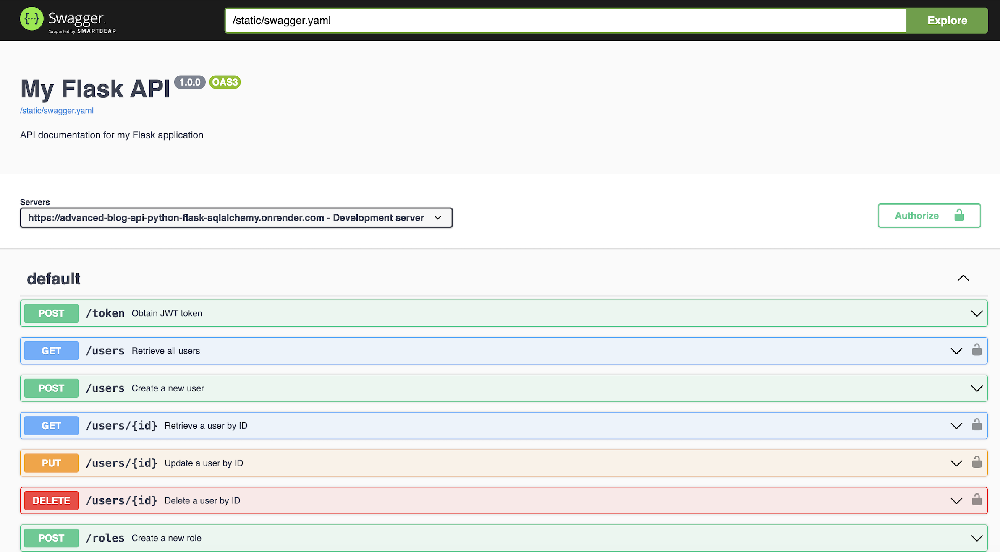

# Advanced Blogging Application with CI/CD, Flask, and SQLAlchemy

This project implements a robust blogging application backend using Flask and SQLAlchemy, enhanced with CI/CD automation for seamless deployment. It includes advanced features for user management with roles, post and comment CRUD operations, JWT security, caching, rate limiting, unit tests, and API documentation with Swagger.

## Features

### Users:

- Create, Read, Update, Delete users.
- Secure password storage with hashed passwords.
- Administrator role required for certain endpoints.

### Posts:

- Create, Read, Update, Delete posts.
- List all posts with essential details.

### Comments:

- Create, Read, Update, Delete comments.
- List all comments on a specific post.

### Database Integration:

- MySQL database integrated using Flask-SQLAlchemy.
- Proper database relationships modeled between users, roles, posts, and comments.
- CI/CD pipelines implemented for automated testing, integration, and deployment.

### Performance Improvement:

- Caching implemented using Flask-Caching for GET requests.
- Rate limiting set to 100 requests per day per endpoint using Flask-Limiter.

### JWT Security:

- Token-based authentication with JWT (JSON Web Tokens).
- Tokens expire after 1 hour for enhanced security.

### Unit Tests:

- Implemented unittests for service layer endpoints.
- Mock library used to simulate various scenarios.

### API Documentation:

- Swagger used to generate API documentation (swagger.yaml file).
- Includes security implementation details using JWT.

### Link to my render URL

### Link to my render URL API Docs

*Screen shots below*

